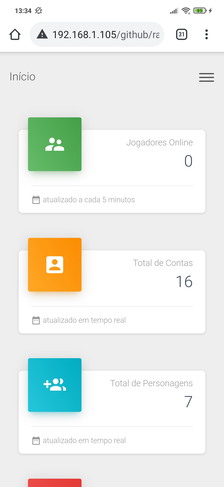
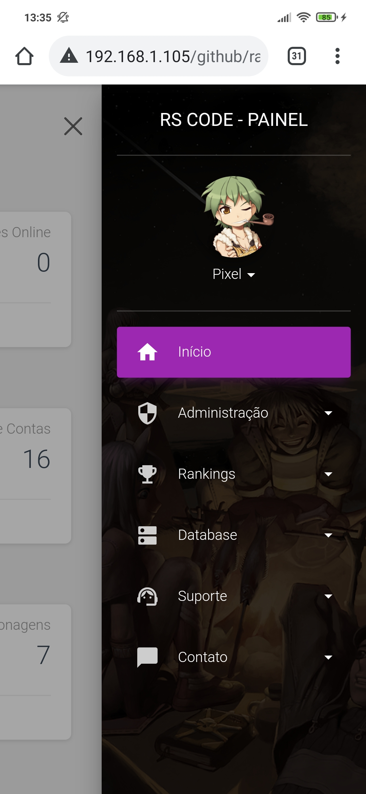
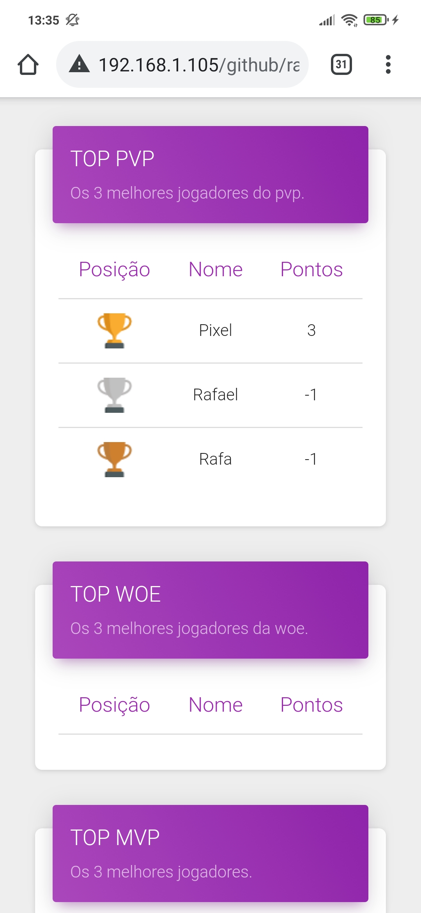
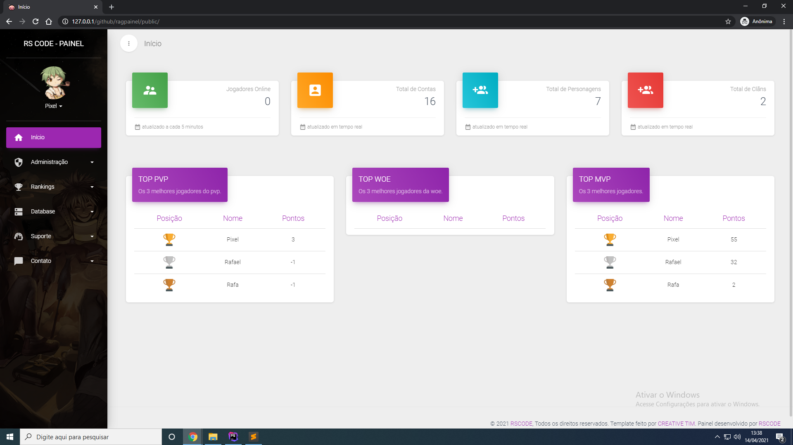
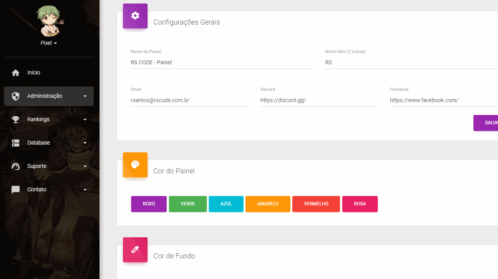

<p align="center">

  

  <a href="https://github.com/rscode/ragpainel/commits/master">
    
  </a>

   
   <a href="https://github.com/rscodexx/devsbook/stargazers">
    
  </a>

  <a href="https://rscode.com.br">
    
  </a>

  <a href="https://blog.rscode.com.br/">
    
    </a>
  
 
</p>

<h4 align="center"> 
	RagPainel 🚀
</h4>

<p align="center">
 <a href="#-sobre-o-projeto">Sobre</a> •
 <a href="#%EF%B8%8F-funcionalidades">Funcionalidades</a> •
 <a href="#-layout">Layout</a> • 
 <a href="#-tecnologias">Tecnologias</a> • 
 <a href="#warning-requisitos-mínimos">Requisitos Mínimos</a> • 
 <a href="#large_blue_circle-instalação-no-windows">Instalação no Windows</a> • 
 <a href="#-contribuidores">Contribuidores</a> • 
 <a href="#-autor">Autor</a> •
 <a href="#user-content--licença">Licença</a>
</p>


## 💻 Sobre o projeto

RagPainel - É um painel de controle desenvolvido para gerenciar contas e personagens de ragnarok online.

## 🎬 <a href="https://rscode.com.br/ragpainel">Demonstração</a>

---

## ⚙️ Funcionalidades

- [x] Geral
  - [x] Visualizar jogadores online.
  - [x] Visualizar total de contas.
  - [x] Visualizar total de personagens.
  - [x] Visualizar total de clãns.
  - [x] Top 3 jogadores de (PVP, WOE e MVP).

- [x] Usuário
  - [x] Criar conta
  - [x] Registrar conta
  - [x] Alterar dados da conta(foto, senha, e-mail e deta de nascimento).
  - [x] Visualizar quantidade de acessos.
  - [x] Visualizar data e hora do último acesso.
  - [x] Visualizar último ip acessado.
  - [x] Visualizar quantidade de dias vip.
  - [x] Visualizar quantidade de créditos.
  - [ ] Esqueceu sua senha
  - [ ] Esqueceu seu login

- [x] Administrador
  - [x] Visualizar Logs
  - [x] Gerenciar Créditos
       - [x] Adicionar
       - [x] Remover
       - [x] Consultar
  - [x] Gerenciar Vip
       - [x] Adicionar
       - [x] Remover
       - [x] Consultar
  - [x] Gerenciar Equipe
       - [x] Adicionar
       - [x] Remover
       - [x] Consultar
  - [x] Gerenciar Banimentos
       - [x] Adicionar
       - [x] Remover
       - [x] Consultar
  - [x] Gerenciar Tickets
       - [x] Visualizar
       - [x] Fechar
       - [x] Responder
  - [x] Configurações do Painel
       - [x] Nome do Painel
       - [x] Nome Mini
       - [x] Email
       - [x] Discord
       - [x] Facebook
       - [x] Definir cor do painel
            - [x] Roxo
            - [x] Verde
            - [x] Azul
            - [x] Amarelo
            - [x] Vermelho
            - [x] Rosa
       - [x] Definir cor de fundo
            - [x] Preto
            - [x] Branco
       - [x] Definir level do jogador vip
       - [x] Definir level do administrador
       - [x] Definir level do game master
       - [x] Definir level do comunnity manager
       - [x] Configurações de Tickets
            - [x] Adicionar Categoria
            - [x] Remover Categoria

- [x] Rankings
  - [x] WOE
  - [x] MVPs
  - [x] Zenys
  - [x] PVP
  - [x] Eventos

- [x] Database
  - [x] Visualizar Itens
  - [x] Visualizar Monstros

- [x] Suporte
  - [x] Criar Ticket
  - [x] Visualizar Tickets

- [ ] Doações
  - [ ] Fazer Doação
  - [ ] Consultar Doações

---

## 🎨 Layout

### :iphone: Celular

<p align="center">
  

  
  
  
</p>

### :computer: Desktop

<p align="center" style="display: flex; align-items: flex-start; justify-content: center;">
  

  
</p>

---

## 🛠 Tecnologias

As seguintes ferramentas foram usadas na construção do projeto:

     

---

## :warning: Requisitos Mínimos

:heavy_check_mark: PHP na versão 7.3 ou superior<br>
:heavy_check_mark: BCMath PHP Extensão ativa<br>
:heavy_check_mark: Ctype PHP Extensão ativa<br>
:heavy_check_mark: Fileinfo PHP Extensão ativa<br>
:heavy_check_mark: JSON PHP Extensão ativa<br>
:heavy_check_mark: Mbstring PHP Extensão ativa<br>
:heavy_check_mark: OpenSSL PHP Extensão ativa<br>
:heavy_check_mark: PDO PHP Extensão ativa<br>
:heavy_check_mark: Tokenizer PHP Extensão ativa<br>
:heavy_check_mark: XML PHP Extensão ativa<br>

---

## :large_blue_circle: Instalação no Windows.

### Pré-requisitos

Antes de começar, você vai precisar ter instalado em sua máquina as seguintes ferramentas:
[GIT](https://git-scm.com/download/win), [Apache](https://httpd.apache.org/docs/2.4/platform/windows.html), [Mysql](https://dev.mysql.com/downloads/installer/) (Ou qualquer outro tipo de banco de dados), [Composer](https://getcomposer.org/download/)

Se você não sabe instalar e configurar um ambiente de servidor, pode utilizar ferramentas que já vem tudo pronto como:
[Apache](https://www.apachefriends.org/pt_br/download.html) [Wamp](https://www.wampserver.com/en/)

Além disto é bom ter um editor para trabalhar com o código como [VSCode](https://code.visualstudio.com/)

#### 🎲 Rodando o Backend (servidor)

```bash

# Clone este projeto
$ git clone https://github.com/rscodexx/ragpainel.git

# Ou baixe o projeto direto do repositório: https://github.com/rscodexx/ragpainel

# Renomeie o arquivo .env-example(está na pasta raiz do projeto) para .env e configure.

DB_CONNECTION=mysql #Tipo de banco de dados.
DB_HOST=127.0.0.1 #IP do banco de dados.
DB_PORT=3306 #Porta do banco de dados.
DB_DATABASE=ragpainel #Tabela do banco de dados.
DB_USERNAME=ragnarok #Usuário do banco de dados
DB_PASSWORD=ragnarok #Senha do banco de dados.
TIMEZONE=America/Sao_Paulo #Horário
LOCALE=pt-BR #Idioma geral.
FALLBACK_LOCALE=pt-BR #Idioma das mensagens de erro.

# Acesse a pasta do projeto em seu terminal/cmd
$ cd ragpainel

# Após entrar no diretório do projeto instale o composer e suas dependências.
$ composer install

# Aguarde a instalação.

# Instale as tabelas do painel, ainda com cmd aberto no diretório do projeto utilize:
$ php artisan migrate

# Pronto, o seu servidor está instalado e configurado.

```

#### 🧭 Rodando a aplicação web (Frontend)

```bash

# Inicie o seu servidor, para acessar o painel é necessário acessar a pasta public, um exemplo abaixo:

$ http://localhost/ragpainel/public

# Você também pode rodar a aplicação sem precisar de um servidor apache configurado através do php artisan.

# Acesse a pasta do projeto em seu terminal/cmd
$ cd ragpainel

# Digite o comando:
$ php artisan serve

# Basta clicar no link gerado para iniciar o painel.

# Use o comando CTRL + C para desligar o servidor.

```

---

## 👨‍💻 Contribuidores

💜 Um muito obrigado para toda a galera que contribui para as melhorias do projeto :)

<table>
  <tr>
    <td align="center"><a href="https://github.com/FranciscoWallison"><br /><sub><b>Francisco Wallison</b></sub></a><br /><a href="https://github.com/FranciscoWallison" title="Francisco Wallison">👨‍🚀</a></td>
  </tr>
</table>

## 💪 Como contribuir para o projeto

1. Faça um **fork** do projeto.
2. Crie uma nova branch com as suas alterações: `git checkout -b my-feature`
3. Salve as alterações e crie uma mensagem de commit contando o que você fez: `git commit -m "feature: My new feature"`
4. Envie as suas alterações: `git push origin my-feature`
> Caso tenha alguma dúvida confira este [guia de como contribuir no GitHub](./CONTRIBUTING.md)

---

## 🦸 Autor

<a href="https://rscode.com.br">
 
 <br />
 <sub><b>Rafael Santos</b></sub></a> <a href="https://rscode.com.br/"</a>
 <br />

[](https://twitter.com/raffrenan) [](https://www.linkedin.com/in/raffrenan/)
[](mailto:raffrenan@gmail.com)

---

## 📝 Licença

Este projeto esta sobe a licença [MIT](./LICENSE.md).

Feito com ❤️ por Rafael Santos 👋🏽 [Entre em contato!](https://www.rscode.com.br)

---

##  Versões do README

[Português 🇧🇷](./README.md)  |  [Inglês](./README-en.md)
